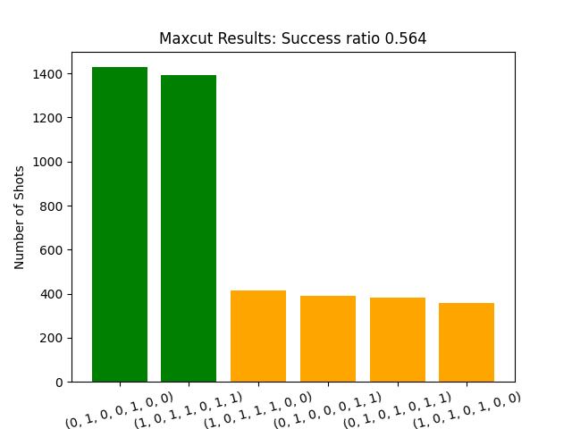
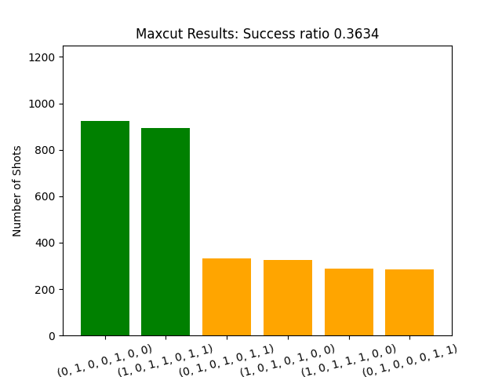

# Neophytes Challange Report

## Challenge 1: Classical Optimization using Stochastic Gradient Descent

The provided code implemented a naive optimization strategy to find the best mixing and cost angles for the MaxCut problem.
In the naive approach, pairs of angles were sampled at random from uniform distributions.
For each pair of angles, the empirical expected value of the Hamiltonian was measured. The angles that yielded the highest expected value of the hamiltonian are returned as best guess.

With the best guess, the MaxCut circuit was run with the `AerBackend`. The success ratio was recorded as the fraction of shots that returned the correct solution to the problem.

The gradient ascent method computes the gradient at every iteration using the `scipy.optimize` method for finite difference approximations. This allows us to direct the parameter search in direction of the steepest increase of the energy surface.

Gradient Ascent methods are sensitive to the choice of the step size by which the parameter vector is updated and can get stuck in local maxima.
To tackle these challenges, we include a naive 'momentum term'. Instead of simply following the gradient, we include a term that maintains some of the 'momentum' of the previous search direction. With this more sophisticated approach, our classical optimization results in a better success ratio than the naive implementation.

For an optimization with 200 iterations, and 5000 shots, the results are shown in the following table and figures.

|               | Naive  | Neophytes |
|---------------|--------|-----------|
| Energy        | 5.03   | 5.46      |
| Success Ratio | 0.3634 | 0.5640    |

Neophytes results angles

Best Cost Angles: [0.38376821141182077, 0.739944298103698, 0.7692712948168382]
Best Mixer Angles: [0.39408217332547335, 0.25219105619534044, 0.1504924633149269]

## Challenge 4: Circuit compilation optimization using TKET's symbolic circuits

For this challenge, we had to optimize the compilation process such that the circuit
does not get re-compiled at every iteration.

To do this, we leveraged [PyTket's symbolic circuits](https://cqcl.github.io/pytket/manual/manual_compiler.html#compiling-symbolic-circuits),
which allow us to define a `Circuit` symbolically and compile it only once at the
start of the program. Since the structure of the circuit is the same at each iteration,
we only need to replace the symbolic values with the concrete ones whenever the circuit
has to be used instead of re-compiling it from scratch, vastly speeding up execution time.

We implemented this functionality in two functions: `qaoa_max_cut_circuit_symbolic` and
`qaoa_max_cut_circuit_fill`.

`qaoa_max_cut_circuit_symbolic` instantiates the symbolic circuit, using symbolic
values for the cost and mixer variables. These are the only values is the circuit that
are changing at each iteration. We call this function at the start of our program
and pass the created symbolic circuit in the rest of the functions that need to make
use of the circuit.

Original calls to `qaoa_max_cut_circuit` were replaced with calls to `qaoa_max_cut_circuit_fill`,
which is responsible for replacing the symbolic values in the symbolic circuit with the
concrete values of cost and mixer at each iteration and return a new circuit with
concrete values without re-compiling it.

